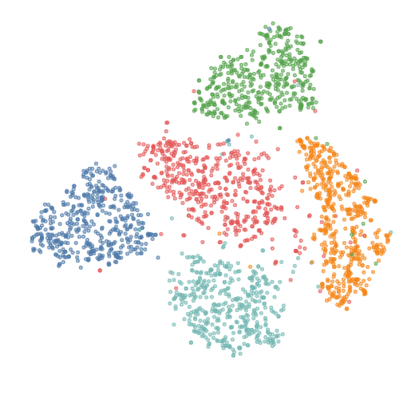

# t-SNE Poster
This repository contains: some figures displayed in the poster, source codes, and references.

## Figures
Kannada MNIST data set with t-SNE and PCA_t-SNE:

MNIST data set with t-SNE and PCA_t-SNE:

MNIST (0~4 digits) with t-SNE (the same figure in poster):

## References
original paper: [Visualizing Data using t-SNE](https://www.jmlr.org/papers/volume9/vandermaaten08a/vandermaaten08a.pdf)

source of the notebook `visualizing-kannada-mnist-with-t-sne.ipynb` and references on visualizing Kannada MNIST: [Visualizing Kannada MNIST with t-SNE](https://www.kaggle.com/code/parulpandey/visualizing-kannada-mnist-with-t-sne) on Kaggle.

Visaulization tools: [Matplotlib](https://matplotlib.org/), [Vega-Altair](https://altair-viz.github.io/), and [Bokeh](https://bokeh.org/).

Datasets in our poster and original paper are available from:
[MNIST data set](http://yann.lecun.com/exdb/mnist/index.html) , [Kannada MNIST data set](https://github.com/vinayprabhu/Kannada_MNIST) , [Olivertti faces data set](http://mambo.ucsc.edu/psl/olivetti.html) , and [COIL-20](https://www.cs.columbia.edu/CAVE/software/softlib/coil-20.php).

some other visualization:
OpenVaccine:[visualization](https://www.kaggle.com/competitions/stanford-covid-vaccine/discussion/186678) and [notebook](https://www.kaggle.com/code/vatsalparsaniya/openvaccine-t-sne-rapids)
[How to Use tSNE effectively](https://distill.pub/2016/misread-tsne/)
[Dimenionality reduction (PCA, tSNE)](https://www.kaggle.com/code/tilii7/dimensionality-reduction-pca-tsne)
[severity of diabetic retinopathy](https://www.kaggle.com/code/code1110/are-there-clusters-pca-tsne-vae)
